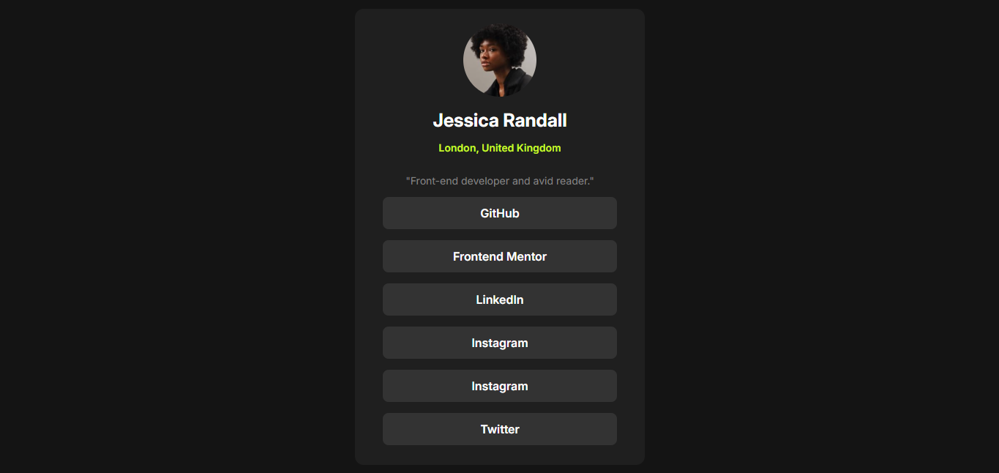

# Frontend Mentor - Social links profile solution

Essa é uma solução para o site [Social links profile challenge on Frontend Mentor](https://www.frontendmentor.io/challenges/social-links-profile-UG32l9m6dQ).

## Sumário

- [Visão Geral](#visão-geral)
  - [O Desafio](#o-desafio)
  - [Screenshot](#screenshot)
  - [Links](#link)
- [Meu processo](#meu-processo)
  - [Construído com](#construido-com)
  - [O que eu aprendi](#o-que-eu-aprendi)
  - [A Desenvolver](#desolvimento-a-continuar)

## Visão Geral

### O desafio

Usuário devem conseguir:

- Ver hover e estados de focus em todos os elementos interativos da pagina

### Screenshot



### Link

- Live Site URL: [Profile - Social links](https://soeiroo.github.io/social-links-profile-main/)

## Meu processo

Eu aprendi bastante com esse mini-projeto, pesquisei muitas dúvidas, passei horas testando funcionalidades que o CSS proporcionava, até que as coisas foram se encaixando e tornando a conclusão desse projeto uma realidade.

### Construído com

- Semantic HTML5 markup
- CSS custom properties
- Flexbox

### O que eu aprendi

Uma das coisas que aprendi e tive bastante dificuldade foi a implantação de fontes que possuem pesos, vindas do Google Fonts.
Aqui está a parte do código que trata sobre isso:

```html
<link rel="preconnect" href="https://fonts.googleapis.com" />
<link rel="preconnect" href="https://fonts.gstatic.com" crossorigin />
<link
  href="https://fonts.googleapis.com/css2?family=Inter:ital,opsz,wght@0,14..32,100..900;1,14..32,100..900&display=swap"
  rel="stylesheet"
/>
```

```css
.inter-InterVariable {
  font-family: "Inter", serif;
  font-optical-sizing: auto;
  font-weight: 100 900;
  font-style: normal;
}
```

Outro ponto de aprendizado, foi em relação ao Flexbox. Tive bastante dificuldade de entender a princípio, porém fui pegando ao ir testando seus poderes, tornando tudo bem mais divertido.

### Desenvolvimento a continuar

Eu pretendo focar em algumas linguagens a partir daqui, sendo uma delas o JavaScript, no qual pretendo implantar nesse projeto e torná-lo mais rico de detalhes.

## Autor

- Website - [soeiroo](https://github.com/soeiroo)
